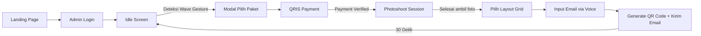

# 📋 PERENCANAAN LENGKAP: PWA AI BOX PHOTOBOOTH
> **Versi:** 2.0.0  
> **Tanggal:** 30 Agustus 2026  
> **Status:** Final & Siap Dikembangkan  
> **Framework:** Next.js 16 App Router + React 19 + TypeScript + Tailwind CSS v4

---

## 🎯 INTISARI KONSEP UTAMA
Sistem **Photobooth AI 100% Client-Side PWA** dengan:
- ✅ Semua pemrosesan AI & gambar berjalan di browser pengguna (Edge Computing)
- ✅ Zero server compute cost — hanya hosting statis + Firestore
- ✅ Offline-first setelah caching awal
- ✅ Kontrol penuh menggunakan Hand Gesture MediaPipe (tanpa sentuh layar)
- ✅ Optimasi performa ekstrem untuk penggunaan 24/7 di perangkat kiosk

---

## 🏗️ ARSITEKTUR SISTEM FINAL

### Stack Teknologi Terpilih
| Kategori | Teknologi | Alasan |
|---|---|---|
| **Frontend** | Next.js 16 App Router | API Routes built-in, PWA ready, Edge Runtime |
| **AI Vision** | `@mediapipe/tasks-vision@1.0.1` | Hand Landmark Detection WASM/WebGL |
| **Canvas** | Konva.js + React-Konva | Compositing gambar 300DPI, layer management |
| **Styling** | Tailwind CSS v4 | Zero runtime, performa maksimal |
| **Animasi** | Framer Motion 11 | Deklaratif, smooth 60fps |
| **Database** | Firebase Firestore | Real-time, free tier murah |
| **Storage Foto** | Google Drive API | ✅ **GRATIS 15GB**, auto share link, tidak ada batasan bandwidth |
| **Email** | Resend | 100 email/hari GRATIS |
| **Payment** | Tripay QRIS | Biaya terendah 0.9% + Rp 100, webhook real-time |
| **PWA** | `@serwist/next` | Service Worker modern, precaching optimal |
| **Hosting** | Vercel Hobby | GRATIS, Edge CDN, HTTPS otomatis |

> ✅ **Rekomendasi Storage:** Google Drive adalah pilihan TERBAIK saat ini. Tidak ada biaya storage, tidak ada biaya bandwidth download, link permanen, dan bisa diakses publik. Jauh lebih murah dan efektif dibanding Firebase Storage / S3.

---

## 🚦 ALUR APLIKASI LENGKAP (STEP BY STEP)

### 1. Landing Page (`/`)
- Hero banner dengan animasi partikel
- Button "Masuk ke Aplikasi"
- Section kontak WhatsApp admin
- Info fitur dan spesifikasi
- Tanpa loading berat, load dalam < 1 detik

### 2. Admin Login (`/login`)
- Form username + password
- Validasi terhadap dokumen `admin` di Firestore
- Session disimpan di localStorage dengan expiry 7 hari
- Setelah login langsung redirect ke `/booth` tanpa delay

### 3. Idle Screen (`/booth`) ✅ PALING KRITIS
> **Optimasi Utama:**
> - ✅ Camera preview berjalan tapi **MediaPipe TIDAK AKTIF** secara penuh
> - ✅ Hanya menjalankan deteksi gerakan sederhana setiap 500ms
> - ✅ CPU usage < 10% pada mode idle
> - ✅ Full screen, tidak ada elemen UI yang tidak perlu
> - Overlay gelap transparan 30%
> - Logo splash di tengah dengan animasi napas lembut
> - Teks animasi: *"Lambaikan tangan untuk memulai 👋"*
> - **Hidden Admin Escape:** Tap pojok kanan bawah 5x berturut-turut untuk memunculkan dialog logout password

### 4. Deteksi Gesture Wave
- Ketika gerakan tangan terdeteksi:
  - Aktifkan MediaPipe Hand Landmarker secara penuh
  - Animasi transisi fade in
  - Tampilkan indikator tangan terdeteksi
  - Setelah 2 detik konfirmasi, buka modal paket

### 5. Pemilihan Paket & Pembayaran
#### Daftar Paket Default (inject ke Firestore):
| Paket | Harga | Jumlah Foto | Cetak | Kirim Email |
|---|---|---|---|---|
| Basic | Rp 15.000 | 3 foto | ✅ 1 lembar | ✅ |
| Standard | Rp 25.000 | 5 foto | ✅ 2 lembar | ✅ |
| Premium | Rp 40.000 | 8 foto | ✅ 3 lembar | ✅ + Bonus Filter |

#### Sistem Pembayaran:
- User memilih paket dengan gesture tangan
- Generate QRIS dinamis via Tripay API
- Polling status pembayaran setiap 3 detik
- Webhook otomatis dari Tripay ke Next.js API Route
- Jika terbayar: lanjut ke sesi photoshoot
- Timeout pembayaran: 5 menit

### 6. Sesi Photoshoot
- Full screen camera preview
- Watermark logo transparan 25% di pojok kanan bawah
- Countdown 3-2-1 di trigger dengan gesture **Tangan Terbuka**
- Setiap foto di capture dan disimpan sementara di IndexedDB
- Progress bar jumlah foto tersisa
- Setelah semua foto terambil: auto lanjut ke layout selection

### 7. Pemilihan Layout Grid
- Tampilkan 4 pilihan layout grid (2x2, 1x3, strip, polaroid)
- Pilih layout dengan gesture tangan:
  - ✊ Fist = Konfirmasi pilih
  - ✌️ Peace = Geser kanan/kiri
- Preview realtime layout dengan foto yang sudah diambil

### 8. Input Email & Pengiriman
- Tampilkan pesan: *"Ucapkan alamat email anda dengan jelas"*
- Gunakan **Web Speech API** (built-in browser) untuk voice to text — TIDAK PERLU API EKSTERNAL ✅
- Tampilkan hasil recognisi dan konfirmasi dengan gesture
- Generate gambar final 300DPI dengan Konva.js
- Upload otomatis ke Google Drive via Service Account
- Generate link share publik
- Kirim email dengan Resend berisi link download
- Tampilkan QR Code di layar selama 30 detik
- Auto kembali ke halaman idle

---

## ⚡ STRATEGI OPTIMASI & PERFORMA

### 1. Optimasi MediaPipe Hand Tracking
| Mode | FPS | CPU Usage | Konfigurasi |
|---|---|---|---|
| **Idle** | 2 FPS | < 10% | Deteksi gerakan sederhana saja, tanpa landmark |
| **Aktif** | 15 FPS | 30-40% | Full hand landmark, WebGL acceleration |
| **Photoshoot** | 30 FPS | 50% | Prioritaskan latency rendah |

> ✅ **Strategi hemat resource:** Jangan jalankan MediaPipe 60fps terus menerus. Aktifkan hanya ketika dibutuhkan.

### 2. Strategi Caching PWA (Service Worker)
| Asset | Strategi Cache |
|---|---|
| Semua halaman core (`/booth`, `/login`) | Pre-cache, cache-first |
| Model MediaPipe `.task` | Pre-cache, permanent cache |
| Asset frame, logo, gambar | Cache-first, max age 30 hari |
| API Payment & Firestore | Network-first, fallback cache |
| Font & CSS | Pre-cache |

> ✅ Setelah load pertama, aplikasi bisa berjalan 100% offline. Hanya butuh internet untuk pembayaran dan upload foto.

### 3. Optimasi Memori
- Hapus semua event listener ketika tidak digunakan
- Bersihkan canvas buffer setiap sesi
- Batasi jumlah foto yang disimpan di memori
- Jalankan garbage collection manual setiap 10 menit
- Nonaktifkan semua animasi ketika tidak terlihat

---

## 🎨 DESAIN SISTEM & UI/UX

### Color Palette Final (Gabungan 2 Style)
> Di ekstrak dari logo `logo-splash.png`

| Warna | Hex | Kegunaan |
|---|---|---|
| **Primary** | `#0EA5E9` | Biru terang, tombol utama, aksen |
| **Secondary** | `#3B82F6` | Biru gelap, gradient |
| **Accent** | `#F97316` | Oranye, indikator aktif, perhatian |
| **Background** | `#F8FAFC` | Putih bersih, dasar halaman |
| **Card** | `#FFFFFF` | Kartu elemen |
| **Dark Overlay** | `rgba(15, 23, 42, 0.7)` | Overlay kamera |
| **Success** | `#10B981` | Status berhasil |
| **Error** | `#EF4444` | Status error |

### Typography
| Elemen | Font | Weight |
|---|---|---|
| Heading | **Inter** | 700 / 800 |
| Body Text | Inter | 400 / 500 |
| Mono / Counter | JetBrains Mono | 400 |

### Prinsip Desain
1. ✅ **Rounded Corners:** Semua elemen menggunakan `rounded-2xl` (16px)
2. ✅ **White Space:** Berikan ruang kosong yang banyak, jangan penuh sesak
3. ✅ **Glass Morphism:** Card dengan `backdrop-blur-xl` dan transparansi
4. ✅ **Animasi Smooth:** Semua transisi 300ms ease-out
5. ✅ **Kontras Tinggi:** Pastikan semua teks terbaca dengan jelas di layar terang

---

## 🔧 LANGKAH PERSIAPAN INTEGRASI

### 1. Payment Gateway Tripay
✅ **Yang perlu disiapkan:**
- Daftar akun Tripay di https://tripay.co.id
- Verifikasi KTP (proses 1x24 jam)
- Ambil API Key Merchant
- Daftarkan Webhook URL ke endpoint `/api/payment/webhook`
- Minimal deposit Rp 100.000 untuk testing

> 💡 Biaya transaksi QRIS Tripay adalah **0.9% + Rp 100** per transaksi. Ini adalah termurah yang tersedia saat ini di Indonesia.

### 2. Google Drive API
✅ **Yang perlu disiapkan:**
- Buat Project di Google Cloud Console
- Aktifkan Google Drive API
- Buat Service Account dan download JSON key
- Buat folder di Google Drive pribadi
- Share folder tersebut ke email service account dengan akses Editor
- Semua foto akan otomatis terupload ke folder ini

### 3. Firebase Firestore
✅ **Yang perlu disiapkan:**
- Gunakan project yang sudah ada: `esp32-smartdoor`
- Buat collection: `admin`, `packages`, `transactions`, `sessions`
- Atur security rules agar hanya admin yang bisa menulis
- Aktifkan Anonymous Authentication

---

## 📅 ROADMAP PENGEMBANGAN BERTAHAP

| Tahap | Durasi | Fitur |
|---|---|---|
| **1** | 1 Hari | Inisialisasi project Next.js, setup Tailwind, PWA |
| **2** | 2 Hari | Integrasi MediaPipe Hand Tracking, halaman idle |
| **3** | 1 Hari | Login admin, Firestore integration |
| **4** | 2 Hari | Sesi photoshoot, canvas compositing |
| **5** | 2 Hari | Payment Gateway Tripay QRIS |
| **6** | 1 Hari | Google Drive upload + Email Resend |
| **7** | 1 Hari | Animasi, polishing UI, optimasi performa |
| **Total** | **10 Hari** | ✅ Semua fitur selesai |

---

## ✅ CHECKLIST FINAL
- [ ] Semua pemrosesan berjalan client-side
- [ ] Tidak ada server GPU yang dibutuhkan
- [ ] Aplikasi bisa berjalan offline setelah caching
- [ ] CPU usage < 10% pada mode idle
- [ ] Semua transaksi pembayaran otomatis
- [ ] Foto otomatis terupload dan terkirim email
- [ ] Tidak ada interaksi sentuh layar dibutuhkan user
- [ ] Sistem bisa berjalan 24/7 tanpa crash

---

> 📌 Dokumen ini adalah panduan utama pengembangan. Semua keputusan teknis sudah dioptimalkan untuk biaya terendah, performa tertinggi, dan pengalaman pengguna terbaik.
