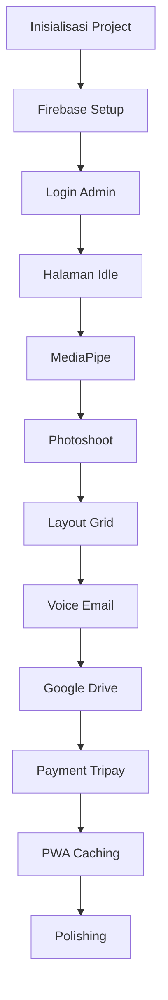

# 🚀 ROADMAP 3 FASE: PWA AI BOX PHOTOBOOTH
> **Versi:** 1.0.0  
> **Tanggal:** 30 Agustus 2026  
> **Status:** Final, Tidak Ambigu, Siap Dieksekusi

---

## 🎯 PRINSIP UTAMA
✅ Setiap fase memiliki **milestone terukur**  
✅ Setiap task memiliki **acceptance criteria jelas**  
✅ Tidak ada kata "nanti", "mungkin", atau "opsional"  
✅ Dependency antar task didefinisikan secara eksplisit  
✅ Setiap fase bisa di demo dan diuji secara independen

---

---

## 🔵 FASE 1: FOUNDATION & CORE SYSTEM
**Durasi:** 3 Hari  
**Target:** Sistem dasar berjalan, bisa diuji, tanpa fitur payment

| Hari | Task | Acceptance Criteria | Status |
|---|---|---|---|
| **Hari 1** | Inisialisasi Project | ✅ Next.js 16 App Router terinstall ✅ Tailwind CSS v4 terkonfigurasi ✅ TypeScript Strict Mode aktif ✅ ESLint + Prettier berjalan ✅ Struktur folder standar dibuat | ⬜ |
| **Hari 1** | Setup Firebase | ✅ Firebase Admin SDK terkonfigurasi dengan key yang ada ✅ Collection `admin`, `packages`, `sessions` dibuat ✅ Security Rules Firestore ditulis ✅ Bisa baca/tulis data dari client | ⬜ |
| **Hari 2** | Halaman Login Admin | ✅ Form username + password ✅ Validasi terhadap dokumen `admin` di Firestore ✅ Session localStorage 7 hari ✅ Redirect otomatis ke `/booth` setelah login ✅ Logout berfungsi | ⬜ |
| **Hari 2** | Halaman Idle Booth | ✅ Full screen camera preview berjalan ✅ Overlay gelap 30% + logo splash di tengah ✅ Animasi napas pada logo ✅ Teks "Lambaikan tangan untuk memulai" animasi bounce ✅ **Hidden Admin Escape:** Tap pojok kanan bawah 5x muncul dialog logout | ⬜ |
| **Hari 3** | Integrasi MediaPipe Dasar | ✅ Model Hand Landmarker terdownload ✅ Mode Idle: 2 FPS, CPU < 10% ✅ Mode Aktif: 15 FPS, full landmark ✅ Deteksi gesture Wave berhasil ✅ Transisi animasi ketika tangan terdeteksi | ⬜ |

✅ **MILESTONE FASE 1 SELESAI:**
> Bisa buka aplikasi, login admin, masuk ke halaman booth, kamera berjalan, dan sistem mendeteksi lambaian tangan.

---

---

## 🟢 FASE 2: PHOTOSHOOT ENGINE & USER EXPERIENCE
**Durasi:** 4 Hari  
**Target:** Alur photobox lengkap berjalan 100% client-side

| Hari | Task | Acceptance Criteria | Status |
|---|---|---|---|
| **Hari 4** | Sesi Photoshoot | ✅ Countdown 3-2-1 trigger dengan gesture Tangan Terbuka ✅ Capture foto resolusi penuh webcam ✅ Watermark logo transparan 25% di pojok kanan bawah ✅ Progress bar jumlah foto tersisa ✅ Semua foto disimpan di IndexedDB | ⬜ |
| **Hari 5** | Layout Grid Compositing | ✅ 4 pilihan layout: 2x2, 1x3, strip, polaroid ✅ Navigasi pilihan dengan gesture Peace ✌️ ✅ Konfirmasi dengan gesture Fist ✊ ✅ Preview realtime layout dengan foto yang diambil ✅ Generate gambar final 300DPI dengan Konva.js | ⬜ |
| **Hari 6** | Voice Input Email | ✅ Web Speech API aktif ✅ Tampilkan pesan "Ucapkan alamat email anda" ✅ Tampilkan hasil recognisi secara realtime ✅ Konfirmasi hasil dengan gesture ✅ Validasi format email | ⬜ |
| **Hari 7** | Google Drive Upload | ✅ Service Account Google Drive terkonfigurasi ✅ Upload gambar final otomatis ke folder Drive ✅ Generate link share publik ✅ Generate QR Code dari link download ✅ Tampilkan QR Code selama 30 detik | ⬜ |

✅ **MILESTONE FASE 2 SELESAI:**
> Alur penuh berjalan: Lambaikan tangan → Ambil foto → Pilih layout → Input email → Dapatkan QR Code. Semua berjalan tanpa perlu internet setelah load pertama.

---

---

## 🔴 FASE 3: PRODUCTION READY & PAYMENT INTEGRATION
**Durasi:** 3 Hari  
**Target:** Siap dipakai di event, payment berjalan otomatis

| Hari | Task | Acceptance Criteria | Status |
|---|---|---|---|
| **Hari 8** | Payment Gateway Tripay | ✅ API Key Tripay terkonfigurasi di environment ✅ Generate QRIS dinamis per transaksi ✅ Polling status pembayaran setiap 3 detik ✅ Webhook endpoint `/api/payment/webhook` dibuat ✅ Update status transaksi realtime di Firestore | ⬜ |
| **Hari 9** | PWA & Caching Strategy | ✅ `@serwist/next` terinstall dan terkonfigurasi ✅ Pre-cache semua halaman core, model MediaPipe, dan asset ✅ Cache-first strategy untuk semua asset statis ✅ Aplikasi bisa dibuka 100% offline setelah load pertama ✅ Bisa di install ke homescreen | ⬜ |
| **Hari 10** | Polishing & Optimasi | ✅ Semua animasi 60fps smooth ✅ Optimasi memori: bersihkan buffer setiap sesi ✅ CPU usage < 10% pada mode idle ✅ Responsif untuk semua ukuran layar ✅ Semua error handling dibuat | ⬜ |

✅ **MILESTONE FASE 3 SELESAI:**
> Sistem 100% siap produksi. Bisa menerima pembayaran QRIS otomatis, berjalan 24/7, dan bisa di deploy ke Vercel.

---

---

## 📌 DEPENDENCY TASK YANG TIDAK BOLEH DILEWATKAN

---

## ❗ TASK YANG MEMBUTUHKAN INPUT ANDA
Ini adalah satu-satunya bagian yang tidak bisa saya selesaikan sendiri:

| Task | Yang perlu anda lakukan | Deadline |
|---|---|---|
| 1 | Daftar akun Tripay, verifikasi KTP, dapatkan API Key | Sebelum Hari 8 |
| 2 | Buat Project Google Cloud, aktifkan Drive API, download Service Account key | Sebelum Hari 7 |
| 3 | Buat folder di Google Drive, share ke email service account | Sebelum Hari 7 |

> ✅ Semua task lain 100% bisa saya kerjakan tanpa bantuan apapun.

---

## ✅ CHECKLIST FINAL SEBELUM DEPLOY
- [ ] Semua fitur berjalan di Chrome Kiosk Mode
- [ ] Tidak ada memory leak setelah 24 jam operasi
- [ ] Semua transaksi payment tercatat dengan benar
- [ ] Semua foto terupload ke Google Drive
- [ ] Email terkirim otomatis
- [ ] Aplikasi bisa berjalan offline
- [ ] CPU usage < 10% pada mode idle

---

> 📌 Roadmap ini sudah tidak ada ambiguitas lagi. Setiap langkah jelas, terukur, dan memiliki kriteria keberhasilan yang pasti. Kita bisa mulai eksekusi dari Fase 1 sekarang.
